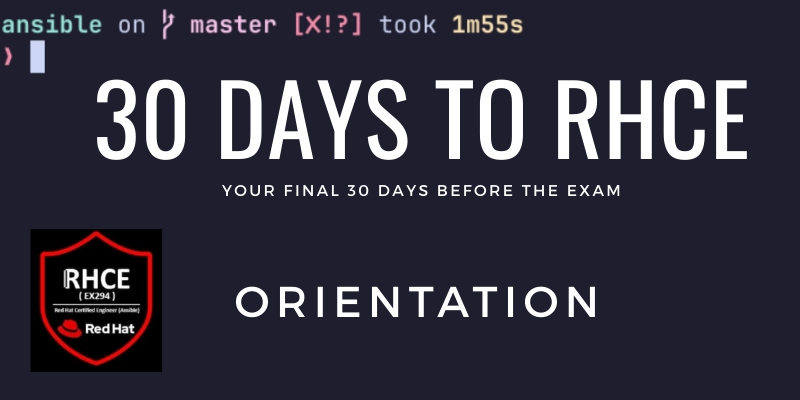

Welcome to the RHCE in 30 Days course!

The case-study for this course will be yours truly. This course is how I will document my final 30 days as I prep for RedHat's RHCE certification exam. 

If I pass?

Then this course will be your guide for your final 30 days. At least if we have similar study styles. I want to do this with as little pain as possible. So here are a few constraints:
1. No flashcards
2. Teach what you learn
3. Have fun!

**No Flashcards**
Flashcards were immensely useful for passing Cisco's CCNA exam. I did not use them to pass RHCSA first try though. I didn't want to. They are mind numbing to me. This goes against point 3 above. 

**Teach what you learn**
From a place of authority, I'll be teaching what I learn. (This course) This is my first time trying this for an exam prep. 

Why?
- Teaching helps depth of knowledge
- Helping others is fun (point 3)
- Adds content to my business (point 3)

**Have fun!**
Doing labs in a vacuum is not fun for me. When I do them I'll be pairing with my RHCE study music playlist. And with helping others by writing content for my business (writing this course).

## Who is this course for?
So like me, you are 30 days away from taking your RHCE exam. 

This is not for complete beginners and not an in depth guide. The course assumes you have been getting hands on practice and have gone through your course material already. 

I have been using Ansible already for 11 months and have configured dozens of servers with Ansible. As a reference point. 

## Scheduling the exam
https://rhtapps.redhat.com/individualexamscheduler/#/Dashboard

## Understand the exam environment
You probably already know this since you are an RHCSA, but RedHat will email you instructions a day or two before the exam.  Check the PDF on this [page](https://learn.redhat.com/t5/Certification-Resources/Getting-Ready-for-your-Red-Hat-Certification-Remote-Exam/ba-p/33528) to get the latest exam requirements documentation. The ISO for the exam USB is also linked in that document. 

## Study music
Study with me! Here is a public [RHCE Study Playlist](https://www.youtube.com/watch?v=lRezaTVzkGk&list=PLz70mC333biez9SVtFiqdhywt4tqVNMze) that you can add your favorite study tunes to. 

## Practice exam
I’ll be working through this [practice exam](https://www.lisenet.com/2019/ansible-sample-exam-for-ex294/) and documenting where I find the answers.

The practice exam has 18 tasks. This gives us roughly 18 days to really drill in and understand each task. 

## Building a lab
The practice exam has 5 Virtual machines. 

## Finding answers during the exam

The devil is in the details. We need to make sure we know where to find answers on the fly during the exam. 

This would be a super easy exam if you had unlimited time. Because you have access to all the official documentation.

Ansible documentation site
Ansible-doc command
Man pages

For every lab or topic. Let’s start using these to find answers instead of a textbook or notes. 

## Git Repo for this course
You can find the course repo here that has all of the labs so you can follow along. 

## CTA
Make sure to subscribe to the newsletter so you