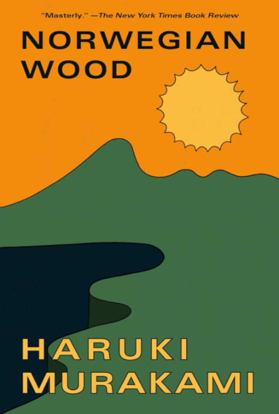

What I am up to [Now](https://nownownow.com/about).

After getting RHCE certified, I was planning on focusing solely on containers. But I realized there is still a lot more to grasp if I want to do Ansible the right way. So right now I am delving a bit into containers, and looking more into Ansible best practices.

Also going for a jog every morning to warm up for the day. Building up to 20 minutes per day. 

My caffeine levels have gotten a bit out of control. So I started tapering by 5mg per day. 

### What I am reading

  

